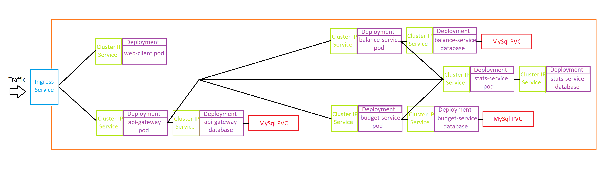

# Monetize

**View online: [monetizeonline.work](http://monetizeonline.work)**

## Description

A budgeting application for rising the user's financial awareness.

- **Main technologies used**: _Production pipeline with CI/CD, Docker and Kubernetes, Microservices with Nest and Typescript, client with React and Redux_
- **Overview**: There are three main services - _Balance, Budget and Statistics_. The _Balance_ service contains the logic about manipulating the user's input payments and the _Budget_ service handles the budget actions. Both services emit to the _Statistics_ service on every change so it has the most recent data. The _Statistics_ service's job is to accumulate all of the payments over a given period and compare them with the budget for that period so it can help the user improve their financial habits. The services are hidden behind the _API Gateway_ which holds the authentication logic and its the single point of entrance for the clients.

## Starting the project

- **Start without containers**: In order to start the application locally without containers you must start all of the services and the client separately. Each project has its own README with instructions that you can follow.

- **Start with docker-compose**: You need to have _docker_ installed on your machine. The _docker-compose.yml_ file is on the root level with all needed configurations and environment variables.

  - Start the containers: `docker-compose up`
  - There are three main databases with migrations and seed scripts that you need to run once in order to initialize properly:
    - Find the _api-gateway_ container and run: `docker exec -it {container id} sh`. Then inside container run `npm run typeorm -- migration:run` and `npm run seed`
    - Find the _balance-service_ container and run: `docker exec -it {container id} sh`. Then inside container run `npm run typeorm -- migration:run` and `npm run seed`
    - Find the budget-service\_ container and run: `docker exec -it {container id} sh`. Then inside container run `npm run typeorm -- migration:run` and `npm run seed`
  - The application will be served on _localhost_.

- **Start with minikube and kubectl**: You need to have _minikube_ and _kubectl_ installed on your machine.
  - Start the minukube virtual machine: `minikube start`
  - Enable the ingress addon: `minikube addons enable ingress`
  - There are four kubernetes secrets that we need to create:
    - JWT key: `kubectl create secret generic jwt-secret --from-literal JWTSECRET=s3cr3t`
    - API Gateway Database Password: `kubectl create secret generic api-gateway-database-password --from-literal PASSWORD=p@ssw0rd`
    - Balance Service Database Password: `kubectl create secret generic balance-service-database-password --from-literal PASSWORD=p@ssw0rd`
    - Budget Service Database Password: `kubectl create secret generic budget-service-database-password --from-literal PASSWORD=p@ssw0rd`
  - Apply the kubernetes configurations from the _k8s_ folder: `kubectl apply -f ./k8s/`. Wait until all of the containers are running.
  - There are three main databases with migrations and seed scripts that you need to run once in order to initialize properly:
    - Find one of the _api-gateway_ pods and run: `kubectl exec -it {pod name} sh`. Then inside container run `npm run typeorm -- migration:run` and `npm run seed`
    - Find one of the _balance-service_ pods and run: `kubectl exec -it {pod name} sh`. Then inside container run `npm run typeorm -- migration:run` and `npm run seed`
    - Find one of the budget-service\_ pods and run: `kubectl exec -it {pod name} sh`. Then inside container run `npm run typeorm -- migration:run` and `npm run seed`
  - Get the ip of minikube: `minikube ip` and open it in the browser.
